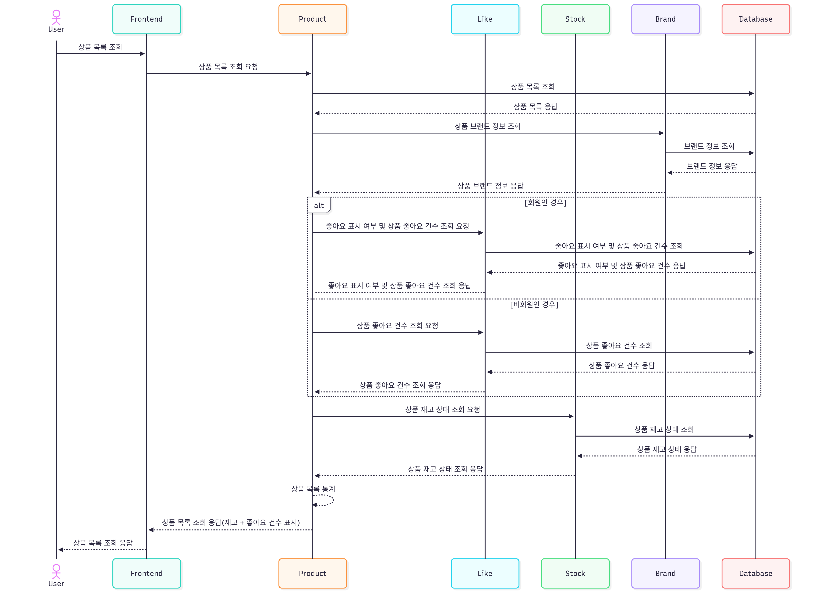
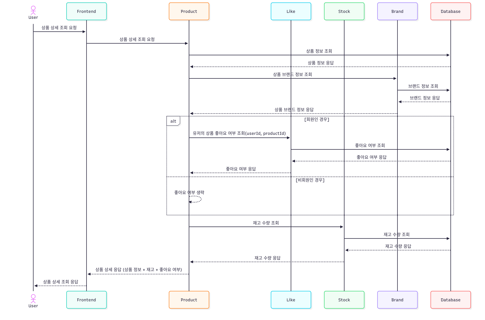
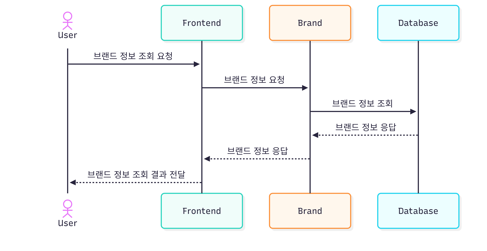
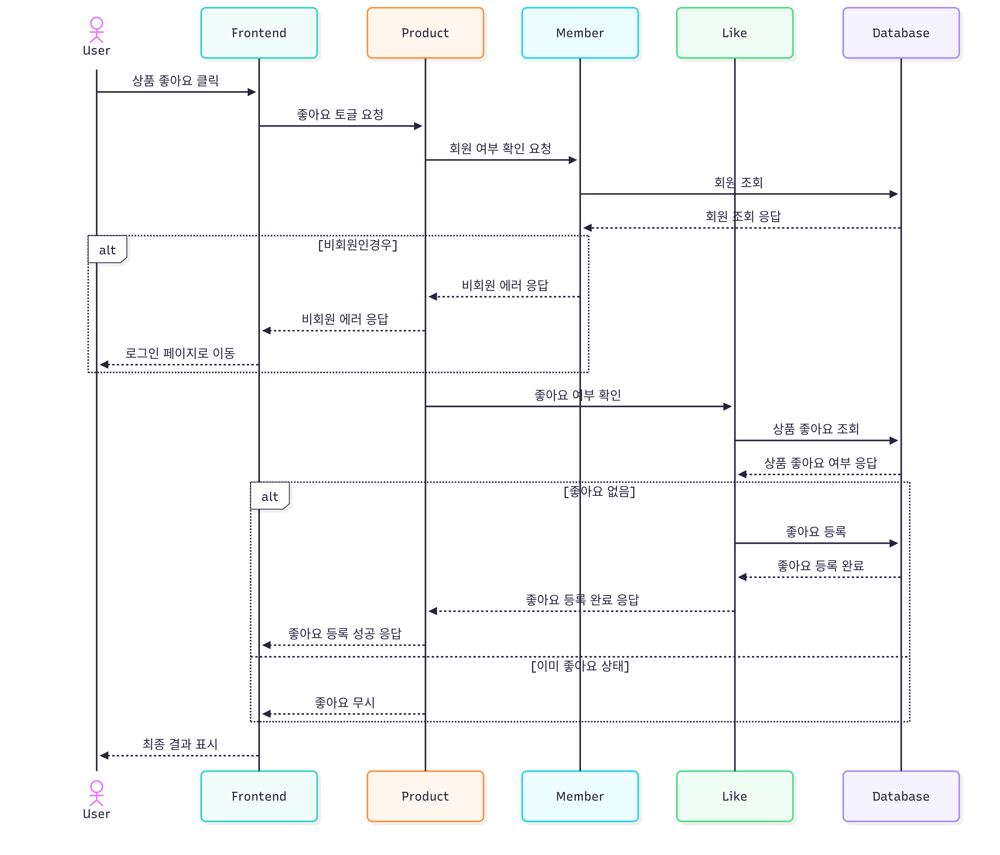
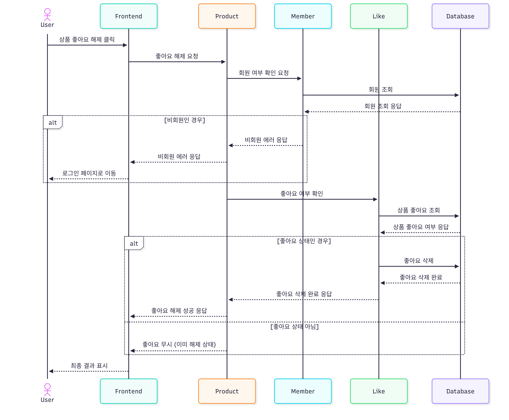
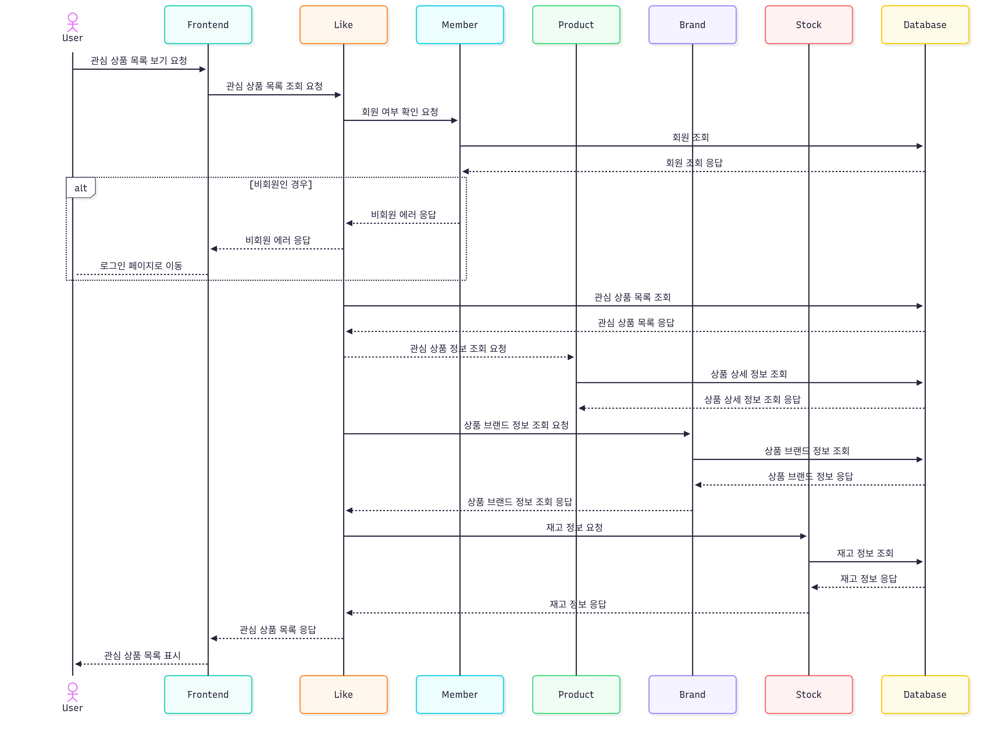
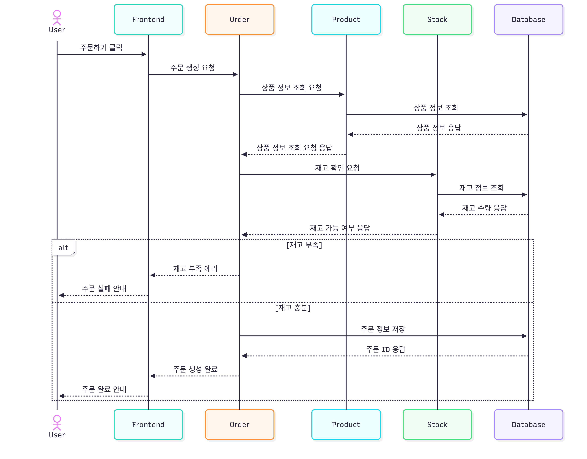

# 🛍️ Loopers 이커머스 - Mermaid 시퀀스 다이어그램
---

## 🧾 FR-001: 상품 목록 조회
```
sequenceDiagram
    actor User
    participant FE as Frontend
    participant P as Product
    participant L as Like
    participant S as Stock
    participant B as Brand
    participant DB as Database

    User->>FE: 상품 목록 조회
    FE->> P: 상품 목록 조회 요청
    P->> DB: 상품 목록 조회
    DB-->>P : 상품 목록 응답
    
    P->>B: 상품 브랜드 정보 조회
    B->>DB: 브랜드 정보 조회
    DB-->>B: 브랜드 정보 응답
    B-->>P: 상품 브랜드 정보 응답
      
    alt 회원인 경우
    P->> L : 좋아요 표시 여부 및 상품 좋아요 건수 조회 요청
    L->> DB : 좋아요 표시 여부 및 상품 좋아요 건수 조회
    DB-->>L : 좋아요 표시 여부 및 상품 좋아요 건수 응답
    L-->P : 좋아요 표시 여부 및 상품 좋아요 건수 조회 응답
    else 비회원인 경우
    P->> L : 상품 좋아요 건수 조회 요청
    L->> DB : 상품 좋아요 건수 조회
    DB-->> L : 상품 좋아요 건수 응답
    L-->> P : 상품 좋아요 건수 조회 응답
    end
    
	P->>S : 상품 재고 상태 조회 요청
    S->>DB : 상품 재고 상태 조회
    DB-->>S : 상품 재고 상태 응답
    S-->> P: 상품 재고 상태 조회 응답

    P-->>P : 상품 목록 통계

    P-->>FE : 상품 목록 조회 응답(재고 + 좋아요 건수 표시)
    FE-->>User: 상품 목록 조회 응답

```


---

## 🛍️ FR-002: 상품 상세 조회
```
sequenceDiagram
    actor User
    participant FE AS Frontend
    participant P AS Product
    participant L AS Like 
    participant S AS Stock
    participant B AS Brand
    participant DB AS Database

    User->>FE: 상품 상세 조회 요청
    FE->>P: 상품 상세 조회 요청

    P->>DB: 상품 정보 조회
    DB-->>P: 상품 정보 응답
    
    P->>B: 상품 브랜드 정보 조회
    B->>DB: 브랜드 정보 조회
    DB-->>B: 브랜드 정보 응답
    B-->>P : 상품 브랜드 정보 응답

    alt 회원인 경우
        P->>L: 유저의 상품 좋아요 여부 조회(userId, productId)
        L->>DB: 좋아요 여부 조회
        DB-->>L: 좋아요 여부 응답
        L-->>P: 좋아요 여부 응답
    else 비회원인 경우
        P-->>P: 좋아요 여부 생략
    end

    P->>S: 재고 수량 조회
    S->>DB: 재고 수량 조회
    DB-->>S: 재고 수량 응답
    S-->>P: 재고 수량 응답

    P-->>FE: 상품 상세 응답 (상품 정보 + 재고 + 좋아요 여부)
    FE-->>User: 상품 상세 조회 응답
```


---

## 🏷️ FR-003: 브랜드 조회
```
sequenceDiagram
    actor User
    participant FE AS Frontend
    participant B AS Brand
    participant DB AS Database

    User->>FE: 브랜드 정보 조회 요청
    FE->>B: 브랜드 정보 요청

    B->>DB: 브랜드 정보 조회
    DB-->>B: 브랜드 정보 응답

    B-->>FE: 브랜드 정보 응답
    FE-->>User: 브랜드 정보 조회 결과 전달

```


---

## 💖 FR-004 : 상품 좋아요 등록
```
sequenceDiagram
    actor User
    participant FE AS Frontend
    participant P AS Product
    participant M AS Member
    participant L AS Like
    participant DB AS Database
    

    User->>FE: 상품 좋아요 클릭
    FE->>P: 좋아요 토글 요청

    P->>M : 회원 여부 확인 요청
    M->>DB : 회원 조회
    DB-->>M : 회원 조회 응답

    alt 비회원인경우
    M-->>P : 비회원 에러 응답
    P-->>FE : 비회원 에러 응답
    FE-->>User : 로그인 페이지로 이동
    end

    P->>L: 좋아요 여부 확인
    L->>DB: 상품 좋아요 조회
    DB-->>L: 상품 좋아요 여부 응답

    alt 좋아요 없음
        L->>DB: 좋아요 등록
		DB-->>L : 좋아요 등록 완료
		L-->>P: 좋아요 등록 완료 응답
        P-->>FE: 좋아요 등록 성공 응답 
    else 이미 좋아요 상태
        P-->>FE: 좋아요 무시 
    end
	
	

    FE-->>User: 최종 결과 표시

```


---

## 💖 FR-005 : 상품 좋아요 해제
```
sequenceDiagram
    actor User
    participant FE AS Frontend
    participant P AS Product
    participant M AS Member
    participant L AS Like
    participant DB AS Database

    User->>FE: 상품 좋아요 해제 클릭
    FE->>P: 좋아요 해제 요청

    P->>M: 회원 여부 확인 요청
    M->>DB: 회원 조회
    DB-->>M: 회원 조회 응답

    alt 비회원인 경우
        M-->>P: 비회원 에러 응답
        P-->>FE: 비회원 에러 응답
        FE-->>User: 로그인 페이지로 이동
    end

    P->>L: 좋아요 여부 확인
    L->>DB: 상품 좋아요 조회
    DB-->>L: 상품 좋아요 여부 응답

    alt 좋아요 상태인 경우
        L->>DB: 좋아요 삭제
        DB-->>L: 좋아요 삭제 완료
        L-->>P: 좋아요 삭제 완료 응답
        P-->>FE: 좋아요 해제 성공 응답
    else 좋아요 상태 아님
        P-->>FE: 좋아요 무시 (이미 해제 상태)
    end

    FE-->>User: 최종 결과 표시

```


---

## 💼 FR-006: 관심 상품 목록 조회
```
sequenceDiagram
    actor User
    participant FE AS Frontend
    participant L AS Like
		participant M AS Member
    participant P AS Product
		participant B AS Brand
    participant S AS Stock
    participant DB AS Database

    User->>FE: 관심 상품 목록 보기 요청
    FE->>L: 관심 상품 목록 조회 요청
	
	L->>M: 회원 여부 확인 요청
	M->>DB: 회원 조회
	DB-->>M : 회원 조회 응답
	
	alt 비회원인 경우
		M-->>L: 비회원 에러 응답
		L-->>FE: 비회원 에러 응답
		FE-->User: 로그인 페이지로 이동
	end

    L->>DB: 관심 상품 목록 조회
    DB-->>L: 관심 상품 목록 응답
    L-->>P: 관심 상품 정보 조회 요청
    P->>DB: 상품 상세 정보 조회
    DB-->>P: 상품 상세 정보 조회 응답
	
	L->>B: 상품 브랜드 정보 조회 요청
	B->>DB: 상품 브랜드 정보 조회
	DB-->>B: 상품 브랜드 정보 응답
	B-->>L: 상품 브랜드 정보 조회 응답

    L->>S: 재고 정보 요청
    S->>DB: 재고 정보 조회
    DB-->>S: 재고 정보 응답
    S-->>L: 재고 정보 응답

    L-->>FE: 관심 상품 목록 응답
    FE-->>User: 관심 상품 목록 표시

```


---

## 🧾 FR-007 : 주문 생성
```
sequenceDiagram
    actor User
    participant FE AS Frontend
    participant O AS Order
    participant P AS Product
    participant S AS Stock
    participant DB AS Database

    User->>FE: 주문하기 클릭
    FE->>O: 주문 생성 요청

    O->>P: 상품 정보 조회 요청
    P->>DB: 상품 정보 조회
    DB-->>P: 상품 정보 응답
    P-->>O: 상품 정보 조회 요청 응답

    O->>S: 재고 확인 요청
    S->>DB: 재고 정보 조회
    DB-->>S: 재고 수량 응답
    S-->>O: 재고 가능 여부 응답

    alt 재고 부족
        O-->>FE: 재고 부족 에러
        FE-->>User: 주문 실패 안내
    else 재고 충분
        O->>DB: 주문 정보 저장 
        DB-->>O: 주문 ID 응답
        O-->>FE: 주문 생성 완료
        FE-->>User: 주문 완료 안내
    end

```


---