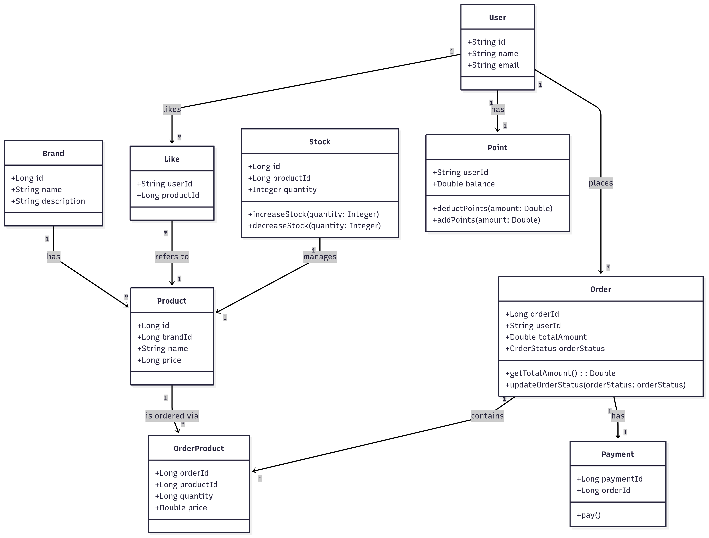

# Loopers 클래스 다이어그램

```
classDiagram
        class Brand {
            +Long id
            +String name
            +String description
        }

        class Product {
            +Long id
			+Long brandId
            +String name
            +Long price
        }

        class Stock {
			+Long id
            +Long productId
            +Integer quantity
            +increaseStock(quantity: Integer)
            +decreaseStock(quantity: Integer)
        }

        class User {
            +String id
            +String name
            +String email
        }

        class Like {
			+String userId
            +Long productId
			
        }

        class Point {
            +String userId
            +Double balance
            +deductPoints(amount: Double)
            +addPoints(amount: Double)
        }

        class Order {
            +Long orderId
            +String userId
            +Double totalAmount
            +OrderStatus orderStatus
			
            +getTotalAmount(): Double
            +updateOrderStatus(orderStatus: orderStatus)
        }

        class OrderProduct {
			+Long orderId
            +Long productId
            +Long quantity
            +Double price
        }

        class Payment {
            +Long paymentId
            +Long orderId
			
            +pay()
        }

        Brand "1" --> "*" Product : has
        Product "1" --> "*" OrderProduct : is ordered via
        Order "1" --> "*" OrderProduct : contains
        User "1" --> "*" Like : likes
        User "1" --> "*" Order : places
        User "1" --> "1" Point : has
        Like "*" --> "1" Product : refers to
        Order "1" --> "1" Payment : has
        Stock "1" --> "1" Product : manages

```



| 출발 클래스         | 도착 클래스        | 관계 설명                                                         | 관계 유형 |
|--------------------|--------------------|--------------------------------------------------------------------|------------|
| Product → OrderProduct | 주문 상품 항목에 포함된 상품 | 하나의 상품이 여러 주문 항목에 포함될 수 있음                             | 1:N        |
| Order → OrderProduct   | 주문에 포함된 주문 상품 항목 | 하나의 주문에 여러 상품이 포함될 수 있음                               | 1:N        |
| User → Like            | 좋아요 누른 상품              | 유저는 여러 상품에 좋아요를 누를 수 있음                              | 1:N        |
| User → Point           | 포인트 잔고                   | 유저는 하나의 포인트 잔고를 가짐                                    | 1:1        |
| User → Order           | 생성한 주문                   | 유저는 여러 개의 주문을 생성할 수 있음                               | 1:N        |
| Like → Product         | 좋아요가 가리키는 상품        | 여러 Like이 같은 상품을 참조할 수 있음                               | N:1        |
| Brand → Product        | 브랜드 소속 상품              | 하나의 브랜드는 여러 상품을 가질 수 있음                              | 1:N        |
| Order → Payment        | 결제 정보                     | 하나의 주문은 하나의 결제 정보와 연결됨                              | 1:1        |
| Stock → Product        | 재고 관리 대상 상품           | 하나의 재고는 하나의 상품을 관리                                     | 1:1        |
