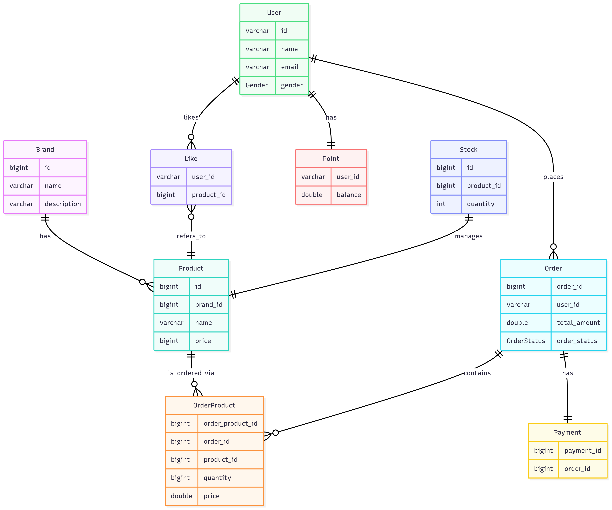

# 📊 Loopers ERD

## ERD
```
erDiagram
    Brand ||--o{ Product : has
    Product ||--o{ OrderProduct : is_ordered_via
    Order ||--o{ OrderProduct : contains
    User ||--o{ Like : likes
    User ||--o{ Order : places
    User ||--|| Point : has
    Like }o--|| Product : refers_to
    Order ||--|| Payment : has
    Stock ||--|| Product : manages

    Brand {
        bigint id
        varchar name
        varchar description
    }

    Product {
        bigint id
        bigint brand_id
        varchar name
        bigint price
    }

    Stock {
        bigint id
        bigint product_id
        int quantity
    }

    User {
        varchar id
        varchar name
        varchar email
        Gender gender
    }

    Like {
        varchar user_id
        bigint product_id
    }

    Point {
        varchar user_id
        double balance
    }

    Order {
        bigint order_id
        varchar user_id
        double total_amount
        OrderStatus order_status
    }

    OrderProduct {
        bigint order_product_id
        bigint order_id
        bigint product_id
        bigint quantity
        double price
    }

    Payment {
        bigint payment_id
        bigint order_id
    }


```



## PK, FK 등 제약 조건 추가
```
CREATE TABLE Brand (
    id BIGINT PRIMARY KEY,
    name VARCHAR(255),
    description VARCHAR(255)
);

CREATE TABLE Product (
    id BIGINT PRIMARY KEY,
    brand_id BIGINT,
    name VARCHAR(255),
    price BIGINT,
    FOREIGN KEY (brand_id) REFERENCES Brand(id)
);

CREATE TABLE Stock (
    id BIGINT PRIMARY KEY,
    product_id BIGINT UNIQUE,
    quantity INT,
    FOREIGN KEY (product_id) REFERENCES Product(id)
);

CREATE TABLE User (
    id VARCHAR(255) PRIMARY KEY,
    name VARCHAR(255),
    email VARCHAR(255) UNIQUE
);

CREATE TABLE `Like` (
    user_id VARCHAR(255),
    product_id BIGINT,
    PRIMARY KEY (user_id, product_id),
    FOREIGN KEY (user_id) REFERENCES User(id),
    FOREIGN KEY (product_id) REFERENCES Product(id)
);

CREATE TABLE Point (
    user_id VARCHAR(255) PRIMARY KEY,
    balance DOUBLE,
    FOREIGN KEY (user_id) REFERENCES User(id)
);

CREATE TABLE `Order` (
    order_id BIGINT PRIMARY KEY,
    user_id VARCHAR(255),
    total_amount DOUBLE,
    order_status VARCHAR(255),
    FOREIGN KEY (user_id) REFERENCES User(id)
);

CREATE TABLE OrderProduct (
    order_product_id BIGINT PRIMARY KEY,
    order_id BIGINT,
    product_id BIGINT,
    quantity BIGINT,
    price DOUBLE,
    FOREIGN KEY (order_id) REFERENCES `Order`(order_id),
    FOREIGN KEY (product_id) REFERENCES Product(id)
);

CREATE TABLE Payment (
    payment_id BIGINT PRIMARY KEY,
    order_id BIGINT UNIQUE,
    FOREIGN KEY (order_id) REFERENCES `Order`(order_id)
);

```