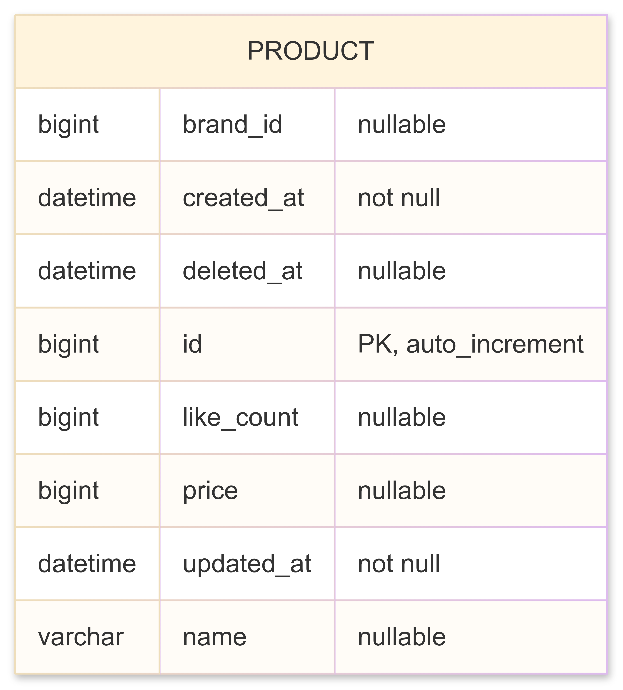

# 반정규화를 이용한 상품 목록 조회 성능 개선
인덱스를 이용한 성능 개선 시에는 다음과 같이 집계 함수에서 병목 지점이 해결되지 않았습니다.
병목이 해결이 되지 않는 이유
- 100만건의 데이터가 존재하는 likes 테이블을 대상으로 left join을 수행하기 때문에 row수가 100만건 조회
- 집계 함수 사용시 임시 테이블이 사용
- 임시 테이블은 인덱스가 사용되지 않음
- 임시 테이블에서 정렬을 수행하기 때문에 큰 비용이 소요
```sql
-> Limit: 20 row(s)  (actual time=3088..3088 rows=20 loops=1)
    -> Sort: `count(l1_0.like_id)` DESC, limit input to 20 row(s) per chunk  (actual time=3088..3088 rows=20 loops=1)
        -> Table scan on <temporary>  (actual time=2902..3041 rows=1e+6 loops=1)
            -> Aggregate using temporary table  (actual time=2902..2902 rows=999999 loops=1)
                -> Left hash join (l1_0.product_id = p1_0.id)  (cost=39.7e+9 rows=397e+9) (actual time=150..716 rows=1e+6 loops=1)

```

조회 성능을 높이기 위해서 likes 테이블 조인 제거 후 product 테이블에 like_count 반 정규화 진행

**반정규화 전**



**반정규화 후**


--- 

## 좋아요 순 상품 목록 조회
**쿼리**
```sql
select p1_0.id,p1_0.name,p1_0.price,p1_0.created_at,p1_0.brand_id,
       b1_0.name,p1_0.like_count
from product p1_0
         join brand b1_0 on p1_0.brand_id=b1_0.brand_id
order by p1_0.like_count desc limit 0,20
```

**실행 시간**
```
20 rows retrieved starting from 1 in 620 ms (execution: 261 ms, fetching: 359 ms)
```

**실행 계획**
```
-> Limit: 20 row(s)  (cost=448958 rows=20) (actual time=293..293 rows=20 loops=1)
    -> Nested loop inner join  (cost=448958 rows=994746) (actual time=293..293 rows=20 loops=1)
        -> Sort: p1_0.like_count DESC  (cost=100797 rows=994746) (actual time=293..293 rows=20 loops=1)
            -> Filter: (p1_0.brand_id is not null)  (cost=100797 rows=994746) (actual time=0.0641..156 rows=1e+6 loops=1)
                -> Table scan on p1_0  (cost=100797 rows=994746) (actual time=0.063..123 rows=1e+6 loops=1)
        -> Single-row index lookup on b1_0 using PRIMARY (brand_id=p1_0.brand_id)  (cost=0.25 rows=1) (actual time=0.00134..0.00135 rows=1 loops=20)

```

**실행 계획 분석**

product 테이블에서 정렬을 인덱스로 수행하지 못함 `Sort: p1_0.like_count DESC`


**인덱스 추가**

정렬을 인덱스로 수행할 수 있도록 인덱스 추가
```sql
CREATE INDEX idx_product_like_count_id ON product(like_count, id);
```

**인덱스 추가 후 실행 시간**

261ms -> 6ms로 단축
```
0 rows retrieved starting from 1 in 350 ms (execution: 6 ms, fetching: 344 ms)
```

**인덱스 추가 후 실행 계획**

정렬 제거 확인
```
 -> Limit: 20 row(s)  (cost=248689 rows=20) (actual time=0.0769..0.186 rows=20 loops=1)
    -> Nested loop inner join  (cost=248689 rows=20) (actual time=0.076..0.182 rows=20 loops=1)
        -> Filter: (p1_0.brand_id is not null)  (cost=0.0266 rows=20) (actual time=0.0637..0.126 rows=20 loops=1)
            -> Index scan on p1_0 using idx_product_like_count_id (reverse)  (cost=0.0266 rows=20) (actual time=0.0624..0.122 rows=20 loops=1)
        -> Single-row index lookup on b1_0 using PRIMARY (brand_id=p1_0.brand_id)  (cost=0.25 rows=1) (actual time=0.00232..0.00239 rows=1 loops=20)

```

--- 

## 가격순 상품 목록 조회

**쿼리**

```sql
select p1_0.id,p1_0.name,p1_0.price,p1_0.created_at,p1_0.brand_id,
       b1_0.name,p1_0.like_count
from product p1_0
         join brand b1_0 on p1_0.brand_id=b1_0.brand_id
order by p1_0.price asc limit 0,20
```

**실행 시간**
```
20 rows retrieved starting from 1 in 634 ms (execution: 284 ms, fetching: 350 ms)
```

**실행 계획** 
```
-> Limit: 20 row(s)  (cost=448958 rows=20) (actual time=327..327 rows=20 loops=1)
    -> Nested loop inner join  (cost=448958 rows=994746) (actual time=327..327 rows=20 loops=1)
        -> Sort: p1_0.price  (cost=100797 rows=994746) (actual time=327..327 rows=20 loops=1)
            -> Filter: (p1_0.brand_id is not null)  (cost=100797 rows=994746) (actual time=0.105..168 rows=1e+6 loops=1)
                -> Table scan on p1_0  (cost=100797 rows=994746) (actual time=0.103..135 rows=1e+6 loops=1)
        -> Single-row index lookup on b1_0 using PRIMARY (brand_id=p1_0.brand_id)  (cost=0.25 rows=1) (actual time=0.00124..0.00124 rows=1 loops=20)
```

**실행 계획 분석**

좋아요 순 상품 목록 조회 동일하게 인덱스를 활용한 정렬이 수행되고 있지 않음


**인덱스 추가**

정렬에 인덱스를 활용하기 위해 인덱스 추가

```sql
CREATE INDEX idx_product_price_id ON product(price, id);
```

**인덱스 추가 후 실행 시간**

284ms -> 7ms로 단축
```
20 rows retrieved starting from 1 in 338 ms (execution: 7 ms, fetching: 331 ms)
```


**인덱스 추가 후 실행 계획**

실행계획에서 정렬이 제거됨

```
-> Limit: 20 row(s)  (cost=248689 rows=20) (actual time=0.0536..0.116 rows=20 loops=1)
    -> Nested loop inner join  (cost=248689 rows=20) (actual time=0.0531..0.114 rows=20 loops=1)
        -> Filter: (p1_0.brand_id is not null)  (cost=0.0266 rows=20) (actual time=0.0437..0.088 rows=20 loops=1)
            -> Index scan on p1_0 using idx_product_price_id  (cost=0.0266 rows=20) (actual time=0.0429..0.0859 rows=20 loops=1)
        -> Single-row index lookup on b1_0 using PRIMARY (brand_id=p1_0.brand_id)  (cost=0.25 rows=1) (actual time=0.00108..0.00111 rows=1 loops=20)


```
---

## 최신 순 상품 목록 조회

**쿼리**
```sql
select p1_0.id,p1_0.name,p1_0.price,p1_0.created_at,
       p1_0.brand_id,b1_0.name,p1_0.like_count
from product p1_0
    join brand b1_0 on p1_0.brand_id=b1_0.brand_id 
order by p1_0.created_at desc limit 0,20
```
**실행 시간**
```
0 rows retrieved starting from 1 in 607 ms (execution: 265 ms, fetching: 342 ms)
```

**실행 계획**
```
-> Limit: 20 row(s)  (cost=448958 rows=20) (actual time=313..313 rows=20 loops=1)
    -> Nested loop inner join  (cost=448958 rows=994746) (actual time=313..313 rows=20 loops=1)
        -> Sort: p1_0.created_at DESC  (cost=100797 rows=994746) (actual time=313..313 rows=20 loops=1)
            -> Filter: (p1_0.brand_id is not null)  (cost=100797 rows=994746) (actual time=0.0835..168 rows=1e+6 loops=1)
                -> Table scan on p1_0  (cost=100797 rows=994746) (actual time=0.082..135 rows=1e+6 loops=1)
        -> Single-row index lookup on b1_0 using PRIMARY (brand_id=p1_0.brand_id)  (cost=0.25 rows=1) (actual time=0.00118..0.00119 rows=1 loops=20)

```

**실행 계획 분석**

인덱스에 의해 정렬이 실행되고 있지 않음

**인덱스 추가**

```sql
CREATE INDEX idx_product_created_at_id ON product(created_at, id);
```

**인덱스 추가 후 실행 시간**

265ms -> 4ms 로 단축
```
20 rows retrieved starting from 1 in 341 ms (execution: 4 ms, fetching: 337 ms)
```


**인덱스 추가 후 실행 계획**

정렬 제거
```
-> Limit: 20 row(s)  (cost=248689 rows=20) (actual time=0.0804..0.397 rows=20 loops=1)
    -> Nested loop inner join  (cost=248689 rows=20) (actual time=0.0795..0.394 rows=20 loops=1)
        -> Filter: (p1_0.brand_id is not null)  (cost=0.0266 rows=20) (actual time=0.065..0.35 rows=20 loops=1)
            -> Index scan on p1_0 using idx_product_created_at_id (reverse)  (cost=0.0266 rows=20) (actual time=0.0637..0.347 rows=20 loops=1)
        -> Single-row index lookup on b1_0 using PRIMARY (brand_id=p1_0.brand_id)  (cost=0.25 rows=1) (actual time=0.00178..0.00183 rows=1 loops=20)

```


## 결과
반정규화와 인덱스를 사용한 결과 60초 -> 7ms로 **8,500**배 실행 시간이 단축되었습니다.


### 반정규화 결과
| 정렬 기준 | 쿼리/전략 | 반정규화 전 → 후 실행 시간 | 반정규화로 인한 변화 |
|---|---|---:|---|
| 좋아요순 (`like_count DESC`) | `likes` 조인 + 집계 → **`product.like_count` 반정규화** | **~60s → ~261ms** | 대용량 조인·집계·임시테이블 제거로 병목 해소 |
| 가격순 (`price ASC`) | `likes` 조인 + 집계 → **`product.like_count` 반정규화** | **~60s → ~284ms** | 대용량 조인·집계·임시테이블 제거로 병목 해소 |
| 최신순 (`created_at DESC`) | `likes` 조인 + 집계 → **`product.like_count` 반정규화** | **~60s → ~284ms**| 대용량 조인·집계·임시테이블 제거로 병목 해소 |

--- 

### 반정규화 후 인덱스 튜닝 결과
| 정렬 기준                  | 추가 인덱스                                                               | 실행 시간 (전 → 후)   | 실행계획 변화(요약)                                            |
| ---------------------- | -------------------------------------------------------------------- | --------------- | ------------------------------------------------------ |
| 좋아요순 `like_count DESC` | `CREATE INDEX idx_product_like_count_id ON product(like_count, id);` | **261ms → 6ms** | `Sort` 제거 → **인덱스 스캔(reverse)** + `brand` PK 단건 Lookup |
| 가격순 `price ASC`        | `CREATE INDEX idx_product_price_id ON product(price, id);`           | **284ms → 7ms** | `Sort` 제거 → **인덱스 스캔** + `brand` PK 단건 Lookup          |
| 최신순 `created_at DESC`  | `CREATE INDEX idx_product_created_at_id ON product(created_at, id);` | **265ms → 4ms** | `Sort` 제거 → **인덱스 스캔(reverse)** + `brand` PK 단건 Lookup |
