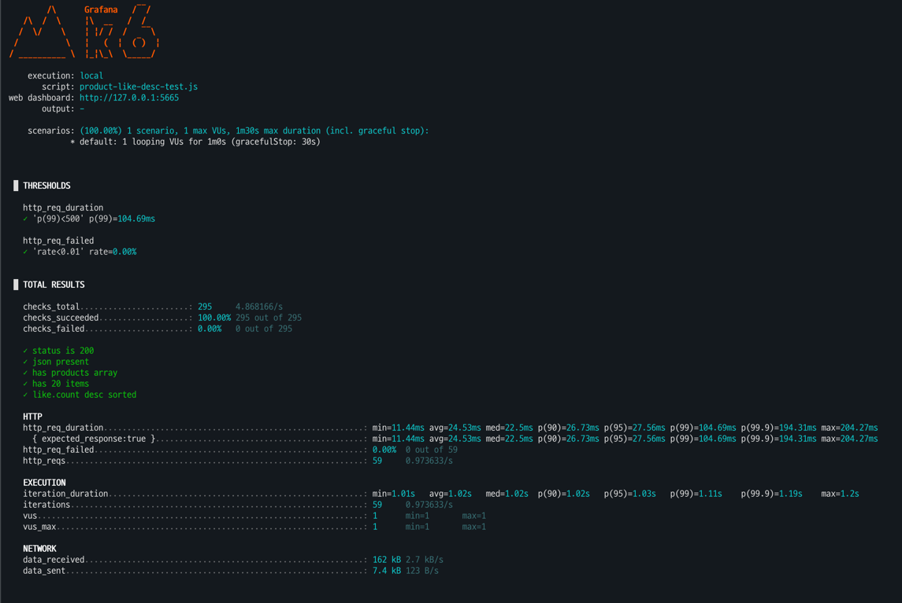
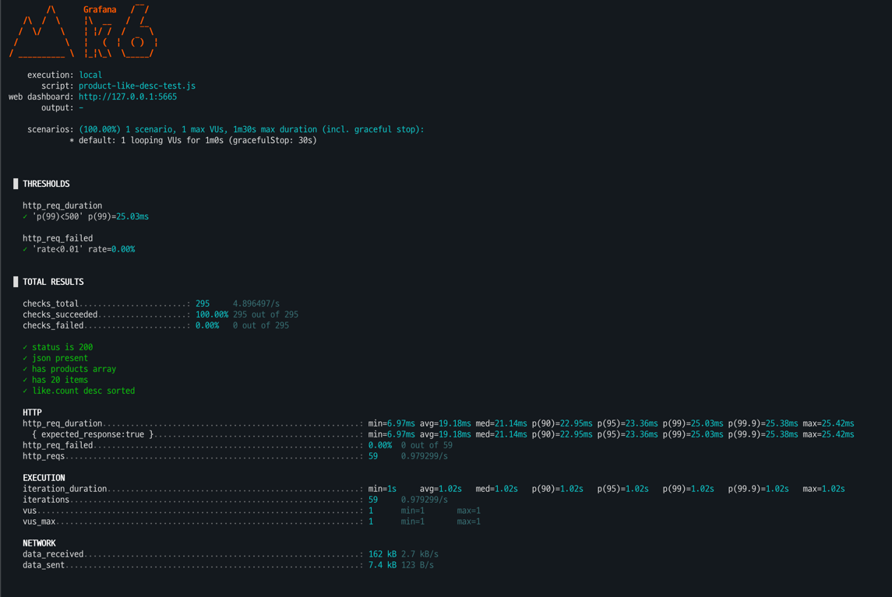

# 캐시를 이용한 상품 목록 조회 성능 개선
API 레이턴시 테스트를 위해 k6를 이용하여 비교를 진행했습니다.

좋아요 순, 가격 순, 최신순 캐시키를 제외하고 동일하기 때문에 대표 1개의 조건만 진행헀습니다.

---

## 캐시 키
캐시 키는 파라미터를 이용하여 구성하였습니다.
```
v1:product:list:b=1:s=likes_desc:p=0:z=20
```

## 상품 목록 조회
### 캐싱 적용 전



### 캐싱 적용 후


---

## 결과

### 성능 결과 요약 비교

> 동일 조건: VU=1, duration=1m, requests=59, 실패율 0%  
> Run A: p99=25.03ms / Run B: p99=104.69ms

### 상세 비교 표
| 지표 | 캐시 적용 | 캐시 미적용 | 변화 |
|---|---:|---:|---:|
| 평균 (avg) | **19.18 ms** | **24.53 ms** | **+27.9%** |
| 중앙값 (med) | 21.14 ms | 22.50 ms | +6.4% |
| p90 | 22.95 ms | 26.73 ms | +16.5% |
| p95 | 23.36 ms | 27.56 ms | +18.0% |
| **p99** | **25.03 ms** | **104.69 ms** | **+318.4%** |
| **p99.9** | **25.38 ms** | **194.31 ms** | **+665.6%** |
| 최대 (max) | 25.42 ms | 204.27 ms | +703.4% |
| 실패율 | 0.00% | 0.00% | 동일 |
| 요청 수 | 59 | 59 | 동일 |
